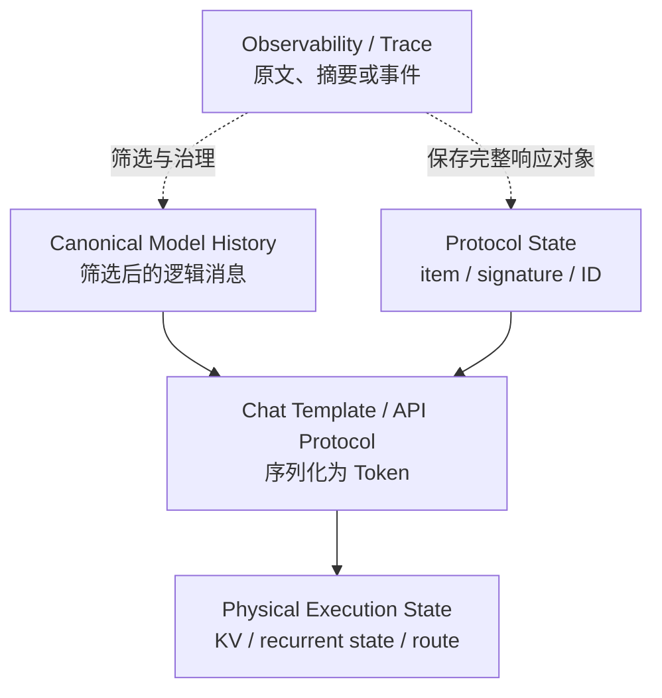
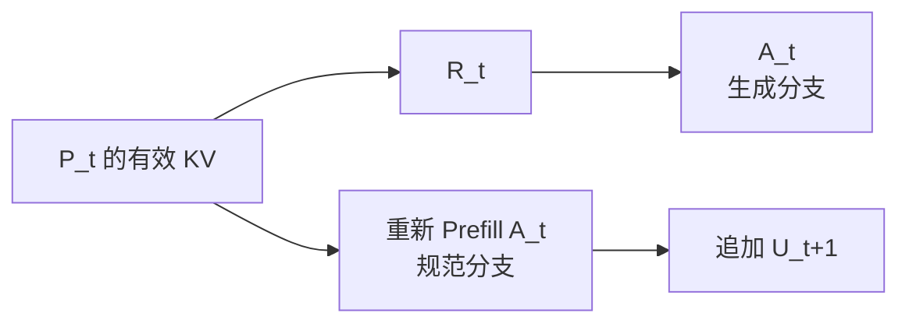

把推理模型接入 Agent 以后，一个很快就会遇到的问题是：模型这一轮生成的思考 Token，下一轮还在不在？

这个问题看似只有“保留”或“丢弃”两个答案，实际系统里却可能同时出现下面三种现象：

1. 链路追踪中保存了完整的 reasoning。
2. 下一轮发给模型的消息里没有上一轮 reasoning。
3. 推理引擎的显存里暂时还留着相关 KV，但新请求已经无法复用其中一部分。

三句话可以同时为真，因为它们分别描述了日志、模型上下文和物理 KV Cache。再加上 API 返回的 signature、reasoning item 等续接状态，系统里实际存在四个需要分别治理的层次。只要把它们混在一起讨论，“到底丢没丢”就一定会得到互相矛盾的答案。

本文从多轮 Agent 的视角拆开这几层状态，并重点回答两个工程问题：

- 为什么工具调用链内通常需要保留 continuation state，而完整用户回合之间却可能删除、过滤或压缩 reasoning？
- 删除 reasoning 会怎样改变 Prefix Cache 命中，为什么最终答案的旧 KV 也不能直接复用？

## 结论先行

如果只记住一条结论，可以记成：

> **工具链内按模型协议保留 continuation state，其中可能包含 reasoning；完整回合结束后，再按协议与任务需要决定保留、过滤或压缩。Prefix Cache 只认精确 Token 前缀，不认语义等价。**

更具体地说：

1. **同一个尚未结束的 Assistant Turn 内**，`reasoning -> tool call -> tool result -> reasoning -> final` 通常是一条连续状态链。很多模型协议要求把 reasoning block、signature 或完整模型响应原样带回。
2. **进入下一个普通用户回合后**，上一轮 reasoning 是否继续进入上下文没有统一规则。它可能被显式回放，也可能被服务端过滤、只保留一部分，或以加密、不可见的状态继续存在。
3. **删除 reasoning 会让 Token 序列从删除点开始分叉**。删除点之前的公共前缀仍可能命中缓存，删除点之后的旧 KV 不能沿用。
4. **最终答案文本保留，不代表最终答案的旧 KV 仍然有效**。答案原本是在包含 reasoning 的上下文里计算的；删除 reasoning 后，注意力上下文和位置都变了，必须重新 Prefill。
5. **缓存命中 Token 变少，不等于整体性能一定更差**。如果 reasoning 很长、最终答案很短，额外重算少量答案 Token，往往能换来更短的长期上下文、更低的 KV 占用和更小的 Decode Attention 开销。

## 一、先区分四层状态

一个完整的 Agent 系统至少同时处理四层状态。

| 状态                        | 典型内容                                                           | 主要所有者                            | 它决定什么                                                     |
| --------------------------- | ------------------------------------------------------------------ | ------------------------------------- | -------------------------------------------------------------- |
| Observability / Trace       | 原始 reasoning、摘要或仅事件，以及工具调用、答案、耗时             | Agent 框架、可观测平台                | 调试、审计、回放与训练数据；具体保存粒度受可见性和合规策略限制 |
| Canonical Model History     | 下一轮逻辑上希望模型看到的消息                                     | Agent 编排层、上下文管理器            | 哪些事实、答案和约束应进入下一轮                               |
| Protocol Continuation State | reasoning item、encrypted content、signature、response ID、call ID | API Adapter、厂商 SDK                 | 下一次 API 调用怎样合法地续接当前状态                          |
| Physical Execution State    | KV、Recurrent State、缓存索引、驻留位置与路由信息                  | 推理引擎、Session Proxy、KV Connector | 哪些计算可以物理复用                                           |

它们的关系更接近下面这张图：



因此，“日志里还在”和“模型下一轮还能看到”不是一回事；“回传了 opaque reasoning item”和“服务端一定复用了同一条 GPU KV Chain”也不是一回事；“KV Block 还没被驱逐”和“当前请求能够命中”仍然不是一回事。

以开源推理服务为例，[vLLM Reasoning Outputs](https://docs.vllm.ai/en/latest/features/reasoning_outputs/) 中的 Parser 可以把模型输出拆成 reasoning 与最终 content，但 Parser 只解决输出解析问题。下一轮是否把 reasoning 重新序列化进 Prompt，仍由客户端消息和 [Chat Template](https://docs.vllm.ai/en/latest/serving/online_serving/#chat-template) 决定。推理引擎最终处理的不是“这段文字在语义上属于思考还是答案”，而是一条确定的 Token 序列及其 KV。

## 二、真正有用的边界是 Assistant Turn

与其问“系统保不保留 CoT”，不如先问当前 Assistant Turn 是否已经结束。

一次带工具的用户请求可能跨越多次 API 调用：

```text
User Request
  -> Reasoning 1
  -> Tool Call 1
  -> Tool Result 1
  -> Reasoning 2
  -> Tool Call 2
  -> Tool Result 2
  -> Final Answer
```

虽然工具结果在不少 API 中被编码为 `user` 消息，但它并不代表一个新的普通用户意图，而是模型完成当前回答所需的中间反馈。对支持工具调用的推理模型来说，这整段流程通常属于一个尚未完成的 Assistant Turn。

在这个边界内，Agent 最安全的处理方式是：

- 保存完整的模型响应对象，而不是只摘出可见文本；
- 不编辑、不合并、不重排 reasoning block 或 signature；
- 将工具调用与对应工具结果保持正确关联；
- 等最终答案产生后，再做跨回合的上下文治理。

到了下一个普通用户消息，系统才进入另一类决策：上一轮 reasoning 对后续任务是否仍然有价值？此时可以有四种策略：

1. 完整保留并显式回放；
2. 交给模型 API 选择性保留；
3. 用 opaque / encrypted state 延续；
4. 删除或压缩，只保留最终答案与关键决策。

所以，一个比“保留或丢弃 CoT”更准确的工程抽象是 **turn-scoped reasoning**：工具链内保持连续，完整回合之间再执行模型相关的保留策略。

## 三、不同模型协议并不统一

截至 2026 年 8 月 24 日，不同厂商对 reasoning state 的协议存在明显差异。下面这张表不是要把它们强行归一，而是说明为什么 Agent Adapter 必须理解具体 API 与模型版本。

| 模型 / API             | 工具链内                                                                 | 完整用户回合之间                                                                                         | 应用侧应怎样做                                                 |
| ---------------------- | ------------------------------------------------------------------------ | -------------------------------------------------------------------------------------------------------- | -------------------------------------------------------------- |
| DeepSeek Thinking Mode | 请求携带 `tools` 时，历史 `reasoning_content` 必须完整回传               | 不携带 `tools` 时，旧 `reasoning_content` 不进入下一轮上下文；携带 `tools` 时规则更严格                  | 不要只根据“这轮是否真的调用工具”判断，应根据请求协议保存并回传 |
| OpenAI Responses API   | reasoning items 可以随工具链继续传递                                     | 可通过 `reasoning.context`、`previous_response_id` 或加密 reasoning items 延续；具体默认值与模型代际有关 | 优先保存完整 output items，不要只保存 `output_text`            |
| Claude Messages API    | 工具调用期间必须把最近 Assistant 消息中的 thinking blocks 完整、原样带回 | 不同模型可能保留全部旧 thinking，也可能只保留最近一轮并由服务端过滤更早内容                              | 回传完整 block，让 API 按模型策略筛选，不要自行修改 signature  |
| Gemini API             | 函数调用中的 thought signature 用来连接后续工具结果                      | SDK 通常自动管理；手工维护 REST 历史时，需要按模型规则原样回传                                           | 保存完整 `Part`，不要把带 signature 的 Part 拆分、合并或换位置 |

[DeepSeek 官方文档](https://api-docs.deepseek.com/guides/thinking_mode/)进一步给出了一个容易踩坑的规则：只要请求携带 `tools`，`reasoning_content` 就必须参与后续上下文拼接，即使某一轮实际没有发生工具调用。遗漏会得到 `400` 错误。

[OpenAI 官方文档](https://developers.openai.com/api/docs/guides/latest-model)则把跨轮 reasoning 变成了显式策略。以 GPT-5.6 为例，`reasoning.context` 默认采用 `all_turns`，可以通过 `previous_response_id` 继续使用之前的 reasoning items；较早模型默认更接近 `current_turn`。在 `store: false` 或 Zero Data Retention 场景下，应用可以回放 API 返回的 encrypted reasoning items。这里的 reasoning item 是协议状态，不等于应用获得了可编辑的原始思维链。

[Claude Thinking 文档](https://platform.claude.com/docs/en/build-with-claude/thinking)明确区分了两条规则：工具调用链内必须保留完整 thinking block；跨普通用户回合是否保留旧 block，则随模型变化。当前一部分模型默认保留全部旧 thinking，另一部分只保留最近一轮，更早内容会被服务端剥离。

[Gemini Thought Signatures 文档](https://ai.google.dev/gemini-api/docs/generate-content/thought-signatures)也强调，手工管理 `generateContent` 历史时应把 signature 放回它原来所在的 `Part`。Gemini 3 的函数调用会严格校验当前 Turn 的 signature，遗漏或错位可能直接返回 `4xx`。在新的 [Interactions API](https://ai.google.dev/gemini-api/docs/interactions-overview) 中，stateful 模式可以通过 `store: true` 与 `previous_interaction_id` 交给服务端续接；stateless 模式仍需要客户端回传完整 thought block 与 signature。

这些差异说明，`reasoning` 不能被设计成一个跨厂商通用的可随意拼接字符串。更合理的抽象是一个带生命周期、来源模型和完整性约束的协议对象。

## 四、Prefix Cache 命中的是精确前缀

Prefix Cache 不是语义缓存。两段消息即使“表达同一个意思”，只要序列化后的 Token 不同，就不能复用同一条 KV 路径。

[vLLM Automatic Prefix Caching](https://docs.vllm.ai/en/v0.14.1/design/prefix_caching/) 使用父 Block Hash、当前 Block 的精确 Token 以及 LoRA、多模态输入、Cache Salt 等附加信息构造缓存键，并且只缓存完整 Block。[SGLang RadixCache](https://github.com/sgl-project/sglang/blob/main/python/sglang/srt/mem_cache/radix_cache.py) 则沿 Token ID 构成的 Radix Tree 查找最长公共前缀。实现不同，但核心条件相同：从序列开头做精确匹配。

用下面的符号描述第 $t$ 轮：

- $P_t$：本轮生成开始前的已有 Prompt；
- $R_t$：本轮 reasoning Token；
- $A_t$：本轮最终答案 Token；
- $U_{t+1}$：下一轮用户输入。

本轮生成结束后，运行时可能拥有这样一条 KV 路径：

```text
P_t | R_t | A_t
```

如果下一轮保留 reasoning，请求序列是：

```text
P_t | R_t | A_t | U_{t+1}
```

如果 KV 尚未被驱逐、请求被路由到可访问它的实例，并且序列化结果完全相同，那么最长可复用前缀可以接近：

```text
P_t | R_t | A_t
```

如果下一轮删除 reasoning，请求序列变成：

```text
P_t | A_t | U_{t+1}
```

它与旧路径在 $P_t$ 之后立刻分叉：

```text
旧路径：P_t | R_t | A_t
新路径：P_t |       A_t | U_{t+1}
```

因此，逻辑上的最长公共前缀通常只剩 $P_t$。系统不是把“整个缓存清空”，而是无法跳过中间的 $R_t$，再继续命中后面的 $A_t$。

对只缓存完整 Block 的 vLLM，如果 Block 大小为 $B$，实际物理命中还可能被截断为：

$$
\left\lfloor \frac{|P_t|}{B} \right\rfloor B
$$

也就是说，分叉发生在一个未满或不完全匹配的 Block 内时，最多还要额外重算 $B-1$ 个尾部 Token。Tokenizer 与模型版本、Chat Template、特殊 Token、LoRA、多模态 Hash、Cache Salt 和 reasoning 配置等元数据也必须兼容，只有文本看起来相同还不够。

这里还要加一个重要限定：上述推导描述的是**逻辑上能够复用上一轮生成 KV 的会话型运行时或 Prefix Cache**。托管 API 是否保留物理 KV、`previous_response_id` 是否直接映射到同一条 GPU KV Chain，通常对应用不可见，也不应从协议字段反推其底层实现。Block 对齐、最后一个生成 Token 是否已经物化为 KV、缓存驱逐、路由和租户隔离，也会让实际命中数略小于理论值。

## 五、为什么最终答案的旧 KV 也不能复用

这是整件事里最容易忽略的一点。下面的推导限定在标准 Decoder-only 因果 Transformer，并且 reasoning 与最终答案实际处于同一条 $P_t \mid R_t \mid A_t$ Token 流中。对于只暴露 opaque state 的托管 API，应用不能假设服务端内部一定采用这条物理序列。

很多人会设想一种“KV 剪切”操作：既然 $R_t$ 不要了，就删除它的 KV，再把 $A_t$ 的 KV 接到 $P_t$ 后面。对标准因果 Transformer 来说，这样做不正确。

旧答案中第 $i$ 个 Token 的 KV 可以抽象为：

$$
KV(A_{t,i}) = f_\theta(P_t, R_t, A_{t,\le i}, p_i)
$$

删除 reasoning 后，规范历史中需要的却是：

$$
KV'(A_{t,i}) = f_\theta(P_t, A_{t,\le i}, p'_i)
$$

两者至少有三处不同：

1. $A_t$ 原本可以注意到 $R_t$，删除后它的前序上下文变了；
2. 删除 $R_t$ 后，答案 Token 的位置编号与 RoPE 相位通常会前移；
3. 前面答案 Token 的隐藏状态改变，又会继续影响后续答案 Token。

即使暂时忽略位置编码，第一点也足以让旧 KV 失效。KV 不是某个 Token 文本自身的静态表示，而是这个 Token 在特定前缀上下文中的中间状态。

所以，删除 reasoning 后可以保留 $A_t$ 的**文本**，但如果需要形成新的物理缓存分支，就必须从 $P_t$ 的有效 KV 开始重新 Prefill $A_t$。旧 $A_t$ 的 KV 仍然是旧分支 $P_t \mid R_t \mid A_t$ 上的合法状态，却不能安全拼接到新分支 $P_t \mid A_t$ 上。

因果性也给出了正确的重算起点：$P_t$ 的 KV 不受其后 $R_t$ 与 $A_t$ 影响，因此可以从 $P_t$ 分叉；不存在把中间 KV 删掉、再把后半段 KV 无损“向前搬”的通用操作。

## 六、缓存命中下降，整体成本反而可能更低

假设：

```text
P_t       = 20,000 tokens
R_t       =  4,000 tokens
A_t       =    300 tokens
U_{t+1}   =    100 tokens
```

在看具体数字之前，先把不同缓存状态拆开。下表均忽略 Block 尾部、模板特殊 Token 与最后一个采样 Token 尚未物化等误差：

| 下一轮可复用状态              |                                                       保留 reasoning 的 Prefill |                                    删除 reasoning 的 Prefill |
| ----------------------------- | ------------------------------------------------------------------------------: | -----------------------------------------------------------: |
| 无缓存                        | $\lvert P_t\rvert + \lvert R_t\rvert + \lvert A_t\rvert + \lvert U_{t+1}\rvert$ | $\lvert P_t\rvert + \lvert A_t\rvert + \lvert U_{t+1}\rvert$ |
| 仅 $P_t$ 可复用               |                    $\lvert R_t\rvert + \lvert A_t\rvert + \lvert U_{t+1}\rvert$ |                    $\lvert A_t\rvert + \lvert U_{t+1}\rvert$ |
| 完整生成分支可复用            |                                                          $\lvert U_{t+1}\rvert$ |                    $\lvert A_t\rvert + \lvert U_{t+1}\rvert$ |
| 已物化规范分支 $P_t \mid A_t$ |                                                            保留策略不适用该分支 |    $\lvert U_{t+1}\rvert$，但此前已支付约 $\lvert A_t\rvert$ |

这张表说明，删除 reasoning 的成本不是一个固定公式。只有当运行时能够复用上一轮完整 Decode KV 时，它相比保留策略在下一轮关键路径上才多出约 $|A_t|$ 的 Prefill；如果只剩 $P_t$，删除 reasoning 反而少计算了 $R_t$。

现在再看完整生成分支仍可复用的例子，并暂时忽略 Block 对齐与模板特殊 Token。

| 策略           | 下一轮 Prompt 长度 | 理论可复用前缀 | 新增 Prefill |
| -------------- | -----------------: | -------------: | -----------: |
| 保留 reasoning |             24,400 |         24,300 |          100 |
| 删除 reasoning |             20,400 |         20,000 |          400 |

在这个特定缓存拓扑下，删除 reasoning 后看起来少命中了 4,300 个 Token，但相比保留策略真正增加的关键路径 Prefill 不是 $R_t + A_t$，而主要是 $A_t$：

$$
\Delta \text{Prefill} \approx |A_t| = 300
$$

原因很简单：$R_t$ 已经不在新 Prompt 中，本来就不需要重算。系统付出的额外成本，是在压缩后的上下文位置重新计算最终答案。

与此同时，后续上下文永久少了 4,000 个 reasoning Token。这会持续减少：

- 每个 Session 的 KV Cache 占用；
- 后续每一步 Decode 需要访问的上下文长度；
- 长会话逼近 Context Window 的速度；
- 历史推理对新问题的干扰与错误锚定。

因此，当 $|R_t| \gg |A_t|$、会话很可能继续、采用密集全注意力，并且跨轮 reasoning 不是协议或质量所需时，删除完整回合的旧 reasoning 是一项很有吸引力的交易：用一次短答案的 Prefill，换取之后每一轮更短的上下文。

还要注意，Token 数并不直接等于 FLOPs。若可复用历史长度为 $H$、新增 Prefill 长度为 $q$，密集全注意力中仅 Attention 工作量就近似包含：

$$
qH + \frac{q(q+1)}{2}
$$

缓存命中也可能需要 HBM 读取或远端 KV 加载。滑动窗口、稀疏注意力、MLA、Mamba / SSM 等架构的成本模型又会不同，因此最终仍要以真实运行指标为准。

但这个结论不应被简化成“永远删除”。如果后续任务需要沿用上一轮的复杂计划、隐含约束或尚未完成的搜索状态，保留结构化 reasoning state 可能提高质量并减少重复思考。正确策略取决于任务连续性、模型协议、上下文预算和实际测量结果。

## 七、不丢弃时，系统怎样保存 reasoning

工程上常见的保留方式大致有三类。

### 1. 显式 Token 回放

适用于暴露 `<think>...</think>` 或 `reasoning_content` 的模型。Agent 保存结构化消息：

```json
{
  "role": "assistant",
  "reasoning_content": "...",
  "content": "...",
  "tool_calls": []
}
```

下一次请求时，Chat Template 按模型协议把它还原成 Token 序列。只有还原后的 Token 与原序列一致，旧 KV 才可能继续命中。多一个空格、换一种模板、改变 thinking 开关或切换模型，都可能让前缀从某个位置开始失配。

### 2. 结构化、不可见的 Reasoning State

OpenAI reasoning item、Claude thinking signature、Gemini thought signature 都可以归入这一类。应用保存的可能是：

- opaque reasoning item；
- encrypted content；
- signature；
- response / interaction ID。

应用不必、通常也不应该解析其中的原始推理。它只负责保持对象完整与顺序正确，再由模型服务端恢复可用的内部状态。

### 3. Stateful Session 或 KV Chain

自托管运行时还可以维护：

```text
conversation_id -> KV block chain
```

下一轮请求不必重新提交或查找全部历史，而是在已有 Session KV 后追加新 Token。P/D 分离场景下，这条 KV Chain 也可能从 Decode 节点转移到 Prefill 节点或外部 KV 存储。

不过，“有 Session ID”并不能改变因果 Transformer 的约束：只要下一轮逻辑 Token 序列与原 KV Chain 不一致，运行时仍然必须回到分叉点重新计算。状态化只能减少状态查找与传输，不能让错误的 KV 变得可复用。

## 八、面向 Agent 的两阶段治理策略

对于长程 Agent，一个实用设计是把 reasoning 生命周期分成两个阶段。

### 阶段一：Turn 进行中，保持协议连续

只要当前工具链还没有产生最终答案：

- 保存完整模型响应与 reasoning state；
- 严格按模型协议回传，不擅自清洗 thinking block；
- 工具等待期间可以把 KV 降级到 CPU 或远端，但不要改变逻辑序列；
- 如果中途切换模型或 Chat Template，把它视为一次显式的上下文迁移，而不是无损续接。

### 阶段二：Turn 完成后，生成规范历史

最终答案产生后，编排层再决定下一轮的 Canonical History：

```text
生成历史：P_t | R_t | A_t
规范历史：P_t |       A_t
```

最简单的实现是只保存规范文本，等下一位用户到来时再 Prefill $A_t$。

### 可选优化：在非关键路径物化规范 KV 分支

如果是自托管、低延迟优先、用户很可能继续对话的系统，还可以考虑在用户思考时间内异步构建新 KV 分支：



步骤是：

1. 保留 $P_t$ 的可复用前缀；
2. 最终答案返回后，从 $P_t$ 分支重新 Prefill $A_t$；
3. 把 $P_t \mid A_t$ 标记为下一轮的规范 Session KV；
4. 释放或降级原来的 $P_t \mid R_t \mid A_t$ 分支。

这不是“免费删除中间 KV”，而是把 $A_t$ 的重算从下一轮 TTFT 路径挪到回合结束后的空闲时间。实现它还要付出几项代价：

- 新旧分支暂时并存，会抬高峰值 KV 占用；
- 后台 Prefill 可能与在线请求争抢算力；
- 用户不再续聊时，预计算完全浪费；
- 用户提前发来下一轮时，需要处理构建竞态并准备 Lazy Prefill 回退；
- 新分支仍可能在下一轮到来前被驱逐。

因此，它更适合根据续聊概率、$R/A$ 长度比、GPU 空闲度和缓存压力选择性触发，而不是每轮固定执行。

需要强调的是，这里的“异步规范分支”是一种运行时设计建议，不代表 vLLM、SGLang 或任意托管 API 已默认实现了这条优化路径。

## 九、不要只看 Prefix Cache Hit Rate

如果系统选择删除旧 reasoning，Prefix Cache 命中率可能下降，但单独看这个指标很容易得出错误结论。至少还应同时观察：

- `cached_input_tokens`：真正跳过计算的输入 Token；
- `uncached_prefill_tokens`：本轮实际执行 Prefill 的 Token；
- `recomputed_history_tokens`：因上下文规范化而重算的历史 Token；
- `active_context_length`：每个 Session 当前有效上下文长度；
- `kv_bytes_per_session`：单会话长期占用的 KV 字节数；
- TTFT：用户发来下一轮消息后的首 Token 延迟；
- TPOT / ITL：上下文缩短后 Decode 单步延迟是否改善；
- 任务质量：保留旧 reasoning 是否减少重复推理，还是让模型继续沿用过时假设。

最终要优化的不是“命中率”这个比例，而是端到端质量、延迟、吞吐与成本。一个命中率更低但上下文短很多的方案，完全可能拥有更低的总成本和更好的长会话稳定性。

## 总结

推理 Token 在多轮系统里没有一个统一的“保留”或“丢弃”答案。正确的判断顺序是：

1. 它是否仍处于同一个工具调用 Turn？
2. 模型协议要求回传什么结构化状态？
3. 下一轮逻辑 Token 序列究竟是什么？
4. 推理引擎是否真的拥有并能够访问对应的 KV 前缀？

删除 reasoning 不会让所有历史缓存凭空失效，但会让序列从删除点开始分叉。由于最终答案原本是在 reasoning 之后计算的，它的旧 KV 也不能直接搬到更短的新上下文中；通常需要重新 Prefill 最终答案。

仅在能够复用上一轮完整生成 KV 的运行时中，可以把两种策略近似写成：

$$
\text{Keep Reasoning Prefill} \approx |U_{t+1}|
$$

$$
\text{Drop Reasoning Prefill} \approx |A_t| + |U_{t+1}|
$$

而删除 reasoning 同时减少了大约 $|R_t|$ 个长期上下文 Token。于是，对长程 Agent 更实用的默认思路通常是：

> **工具链内保留协议要求的 continuation state；完整回合结束后，再按模型版本、质量需求与缓存经济性决定保留、压缩或删除 reasoning。删除中间 reasoning 会让 KV 路径分叉，但成本取决于真实可复用的缓存层级。**

## 参考资料

1. OpenAI, [Model guidance: persisted reasoning](https://developers.openai.com/api/docs/guides/latest-model)
2. DeepSeek, [Thinking Mode](https://api-docs.deepseek.com/guides/thinking_mode/)
3. Anthropic, [Thinking](https://platform.claude.com/docs/en/build-with-claude/thinking)
4. Google, [Thought signatures](https://ai.google.dev/gemini-api/docs/generate-content/thought-signatures)
5. vLLM, [Automatic Prefix Caching](https://docs.vllm.ai/en/v0.14.1/design/prefix_caching/)
6. vLLM, [Reasoning outputs](https://docs.vllm.ai/en/latest/features/reasoning_outputs/)
7. SGLang, [RadixCache implementation](https://github.com/sgl-project/sglang/blob/main/python/sglang/srt/mem_cache/radix_cache.py)
